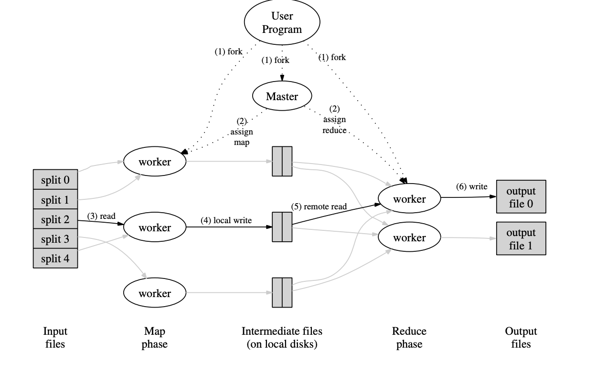
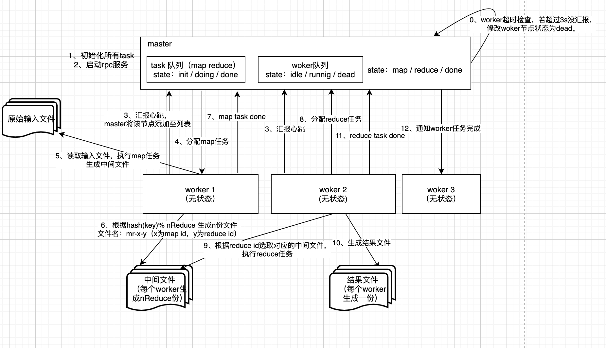
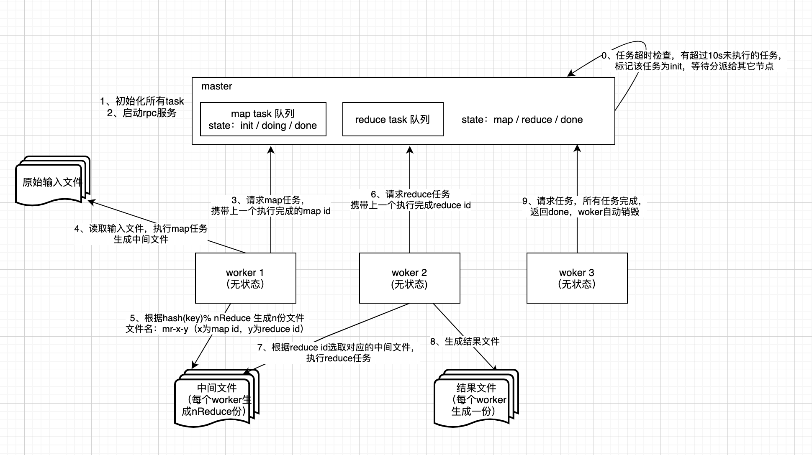

# BackGround
6.824是mit的一门分布式课程。通过该课程，可以完成map-reduce、raft的实现，并依据raft实现一个分布式的分片kv数据库。此外，课程内还包含大量的分布式领域的论文阅读。  

官方课程链接：https://pdos.csail.mit.edu/6.824/schedule.html  
b站网课：https://www.bilibili.com/video/av87684880/​  
优秀课程翻译：https://mit-public-courses-cn-translatio.gitbook.io/mit6-824/  

# Progress
✅lab1  
🔘lab2  
🔘lab3  
🔘lab4  

# Lab1 : MapReduce
## Execution Overview

- 用户指定map reduce程序，中间结果的分片数量R，用于切分中间结果的hash函数
- 输入的文件会被分为 M个 Split，每个 Split 的大小通常在 16~64 MB 之间
- 因此，整个mr计算会包含M个map任务和R个reduce任务
- master会从空闲work中选取节点，并分配map reduce任务
- map任务会将产生的中间结果存放到本地磁盘中，并调用用户提供的hash函数进行分片。最后将文件存放位置上报给master
> 这里实现的太巧妙了！！！若key相同，分片的number则一定相同。因此，同一个键的中间结果都存在相同编号的分片文件上。有多少个分片就对应有多少个reduce任务，每个reduce任务只需要请求固定编号的分片。
- master会将map上报的文件位置信息转发给reducer，reducer发起rpc请求给mapper，读取对应分片文件。
 - reducer会将拿到的结果进行排序，收集每个键对应的所有结果值，调用用户提供的reduce程序。最后产生对应的reduce分片文件。

## Implement
论文中与6.824描述的实现方式稍有不同，主要区别在于任务的分发和响应。按照论文中的描述，mr任务是由master主动纷发给worker节点，待worker节点完成工作后，再将任务结果汇报给master，如图二。而lab中的描述为worker主动请求master获取任务，下次再获取任务时，携带上一次的任务产出。因此只需要一次交互。此外，采用lab描述的方式，master也无需维护一个worker列表，以及woker状态的探测（因为他根本就不需要挑选worker），只需要等着分派任务即可。

图二：

图三：

