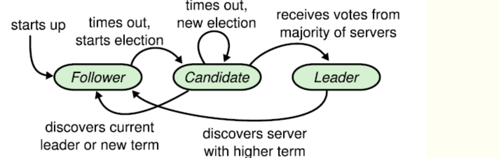

# Lab2 : Raft-2A Leader Election
raft中，一共有三种状态：follwer、candidate、leader。状态的转换如图所示：

### 选举者的选举过程
1. 若超时选举时间到达，follower一直没有没有收到leader的心跳，则开始发起选举
1. 增加节点本地的 currentTerm，切换到candidate状态&投自己一票
2. 并行给其他节点发送 RequestVote RPCs
3. 等待其他节点回复，有三种可能性: 
    - 收到majority的投票，成为leader
    - 被告知别人已当选，那么自行切换到follower（收到了不低于自己term的leader心跳）
    - 一段时间内没有收到majority投票，则保持candidate状态，重新发出选举（平票）
### 投票者的投票约束
1. 如果选举者的任期号，小于自己当前的任期号，拒绝
2. trem任期中的voteFor需要为空 或者 是候选人id （非常重要，保证在一个任期内，只能给一个节点投票）
3. 候选人最后一条Log条目的任期号大于本地最后一条Log条目的任期号。或者，候选人最后一条Log条目的任期号等于本地最后一条Log条目的任期号，且候选人的Log记录长度大于等于本地Log记录的长度
## Implement
状态的定义：
```golang
type state int

const (
	FOLLOWER state = iota
	CANDIDATE
	LEADER
)

func (s state) String() string {
	if s == FOLLOWER {
		return "FOLLOWER"
	}
	if s == CANDIDATE {
		return "CANDIDATE"
	}
	if s == LEADER {
		return "LEADER"
	}
	return ""
}
```

计时功能我想到两种实现方式。第一种方式法是采用time.Sleep(timeout)，时间到达后用当前时间 - 心跳接收时间，若时间差>timeout即代表超时。但是采用这种方式，在很多情况下并不精准。第二种方式是采用golang标准库提供的time.Timer。Timer结构体自带的Reset()可以重置计时器，非常符合我们的场景。  

对应leader，需要进行发送心跳包的计时功能。对于follower和candidate，需要实现超时选举的计时功能。我这里将两个逻辑放到一个goroutine中。关于两个timeout的时间设置，给出的test case要求心跳频率不超过10次/s，且必须在五秒内完成选举。这里也给出我的设置作为参考。代码如下：
```golang
const (
	HEARTBEAT_INTERVAL = time.Millisecond * 200 // tester要求心跳频率不能大于10次/s
	ELECT_TIMEOUT_MIN  = 2000                   // ms
	ELECT_TIMEOUT_MAX  = 3000                   // ms
)

func (rf *Raft) tick() {
	for rf.killed() == false {
		select {
		case <-rf.heartBeatTimer.C:
			rf.heartBeatTimer.Reset(HEARTBEAT_INTERVAL)
			rf.mu.RLock()
			if rf.role == LEADER {
				rf.debug("start heartbeat ")
				rf.heartBeat()
			}
			rf.mu.RUnlock()
		case <-rf.electTimer.C:
			rf.mu.Lock()
			if rf.role != LEADER {
				rf.debug("start elect ")
				rf.startElect()
			}
			rf.mu.Unlock()
		}
	}
}
```

开始选举的逻辑是严格遵守着论文中的描述，我认为有两个容易忽略的小地方。第一个是若选举人当选为leader，需要立刻发起心跳，避免其他的节点开始竞争上岗。第二个是如果在请求投票的rpc响应中，如果收到了大于自己的term，需要放弃选举并转换为follwer。
```golang
func (rf *Raft) startElect() {
	vote := 1
	rf.role = CANDIDATE
	rf.votedFor = rf.me
	rf.currentTerm++
	rf.electTimer.Reset(randomElectTime())
	req := &RequestVoteArgs{
		Term:        rf.currentTerm,
		CandidateId: rf.me,
	}
	if len(rf.log) > 0 {
		req.LastLogIndex = rf.log[len(rf.log)-1].Idx
		req.LastLogTerm = rf.log[len(rf.log)-1].Term
	} else {
		req.LastLogIndex = -1
		req.LastLogTerm = -1
	}
	for idx := range rf.peers {
		if idx == rf.me {
			continue
		}
		go func(idx int) {
			reply := &RequestVoteReply{}

			rf.mu.RLock()
			rf.debug("start send request vote to [%v] ", idx)
			rf.mu.RUnlock()

			ok := rf.sendRequestVote(idx, req, reply)
			rf.mu.Lock()
			defer rf.mu.Unlock()
			if ok {
				// get vote
				if reply.VoteGranted {
					vote++
					rf.debug("get vote from peer[%v]", idx)
					// reach half election
					if vote > len(rf.peers)/2 {
						rf.role = LEADER
						rf.debug("become leader with term[%v] ", rf.currentTerm)
						rf.heartBeat()
					}
				} else {
					rf.debug("get vote fail from [%v], his currentTerm[%v] and voteFor[%v]", idx, reply.Term, reply.Votefor)
					if reply.Term > rf.currentTerm {
						rf.debug("get large term[%v], become follower", reply.Term)
						rf.role = FOLLOWER
						rf.currentTerm = reply.Term
						rf.votedFor = -1 // did not vote at this term
					}
				}
			} else {
				rf.warn("request vote fail from peer[%v] ", idx)
			}
		}(idx)
		if rf.role != CANDIDATE {
			break
		}
	}

}
```

RequestVote rpc的实现。这里也需要注意，若收到的请求中包含有比自己大的term，则将自己的状态切换为followe，并更新自己的term。
```golang
type RequestVoteArgs struct {
	Term         int
	CandidateId  int
	LastLogIndex int
	LastLogTerm  int
}

type RequestVoteReply struct {
	Term        int
	VoteGranted bool
	Votefor     int
}

func (rf *Raft) RequestVote(args *RequestVoteArgs, reply *RequestVoteReply) {
	rf.mu.Lock()
	defer rf.mu.Unlock()
	// term比自己小 & 同一任期投给了别人
	if args.Term < rf.currentTerm || args.Term == rf.currentTerm && rf.votedFor != args.CandidateId && rf.votedFor != -1 {
		reply.Term = rf.currentTerm
		reply.VoteGranted = false
		reply.Votefor = rf.votedFor
		return
	}
	// 遇到比自己大的term，该表自己的状态
	if args.Term > rf.currentTerm {
		rf.currentTerm = args.Term
		rf.votedFor = -1
		rf.role = FOLLOWER
	}
	if !rf.logUpdate(args.LastLogIndex, args.LastLogTerm) {
		reply.Term, reply.VoteGranted = rf.currentTerm, false
		return
	}
	rf.votedFor = args.CandidateId
	rf.electTimer.Reset(randomElectTime())
	reply.Term, reply.Votefor, reply.VoteGranted = rf.currentTerm, rf.votedFor, true

}

func (rf *Raft) logUpdate(idx, term int) bool {
	myidx := -1
	myterm := -1
	myloglen := len(rf.log)
	if myloglen > 0 {
		myidx = rf.log[myloglen-1].Idx
		myterm = rf.log[myloglen-1].Term
	}
	if myterm > term {
		return false
	}
	if myterm == term && myidx > idx {
		return false
	}
	return true
}
```

心跳广播的逻辑就比较简单拉，如下：
```golang
func (rf *Raft) heartBeat() {
	l := len(rf.peers)
	stop := make(chan struct{}, 1)
	for i := 0; i < l; i++ {
		if i == rf.me {
			continue
		}
		select {
		case <-stop:
			break
		default:
		}
		go func(idx int) {
			rf.mu.RLock()

			args := &AppendEntriesArgs{}
			reply := &AppendEntriesReply{}
			args.Term = rf.currentTerm
			args.LeaderId = rf.me
			args.PrevLogIndx = -1
			args.PrevLogTerm = -1
			if len(rf.log) > 0 {
				args.PrevLogIndx = rf.log[len(rf.log)-1].Idx
				args.PrevLogTerm = rf.log[len(rf.log)-1].Term
			}
			args.LeaderCommit = rf.commitIndex
			rf.mu.RUnlock()
			rf.peers[idx].Call("Raft.AppendEntries", args, reply)

			rf.mu.Lock()
			// 若发现term比自己大的响应，就再变成follower
			if reply.Term > rf.currentTerm {
				rf.role = FOLLOWER
				rf.currentTerm = reply.Term
				rf.votedFor = -1
				rf.mu.Unlock()
				stop <- struct{}{}
			} else {
				rf.mu.Unlock()
			}
		}(i)
	}

}
```